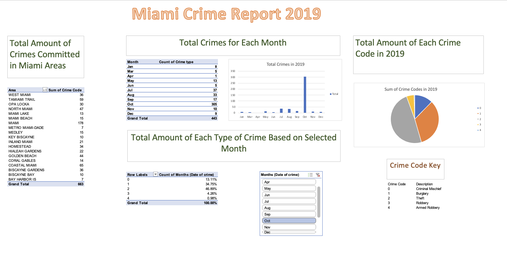

# DAT-375 Module 6 Miami-PD Weather & Crime Analysis
_**Summary**_

This project focuses on a set of data, provided by the Miami Police Department, covering total crime reports in the Miami area in 2019. The dataset includes the date of the crime, crime type, crime location within the Miami PD jurisdiction, and other details of each event. The police department is wanting to know if additional resources and funding should be allocated during months where there are higher rates of inclement weather or hurricane warnings (roughly July through November). Additional information such as crime type and crime location will help determine what funding is necessary for specific units and areas.

_**Results & Analysis**_

An excel dashboard was created to display key information that was requested by Miami PD for their provided data set. Results include that the City of Miami accounted for the largest amount of reported crime in the year with 178 instances of reported crime. The largest type of reported crime was theft. Furthermore, months during hurricane season accounted for the highest amount of reported crimes with October being the highest. Within October, the highest reported crime type was theft, followed by burglary then criminal mischief. Therefore, it is recommended that the Miami PD allocate additional resources and funding for the City of Miami during hurricane season to combat theft. Additional, smaller-scale resources for burglary and criminal mischief are also recommended for future focus.

